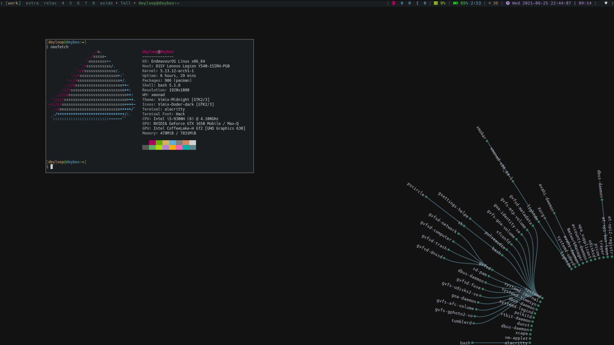
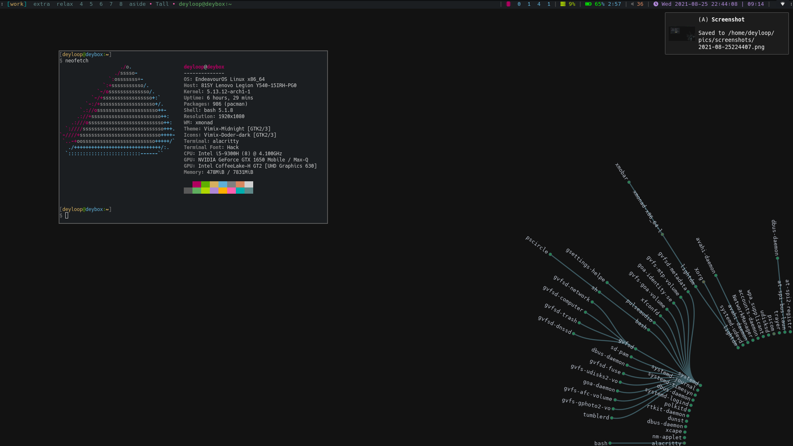
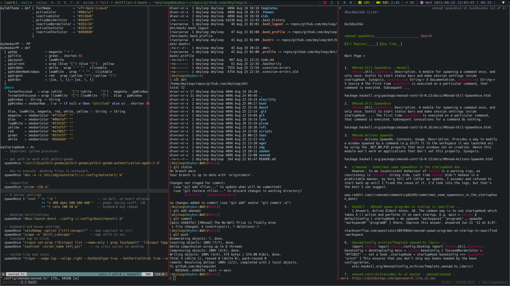
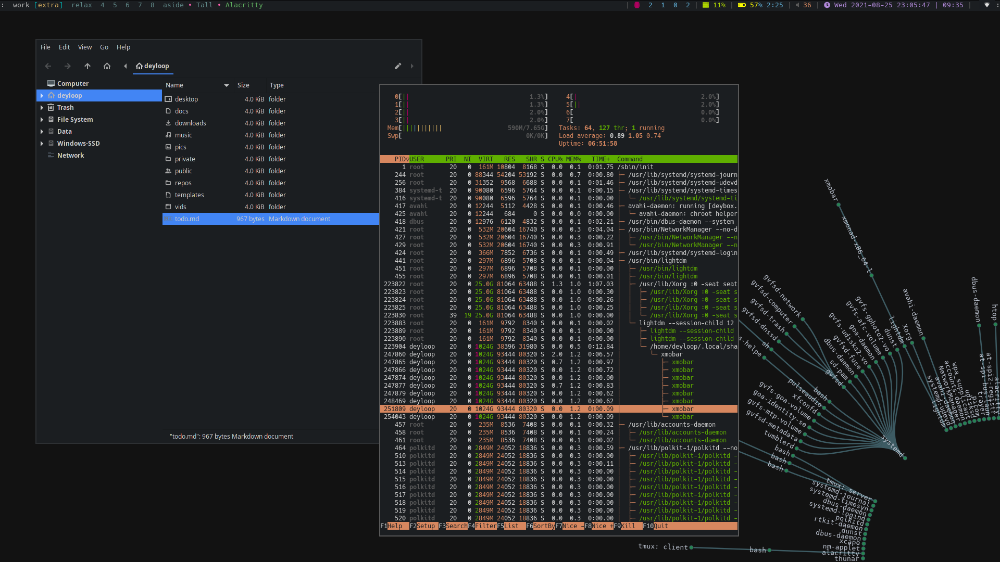
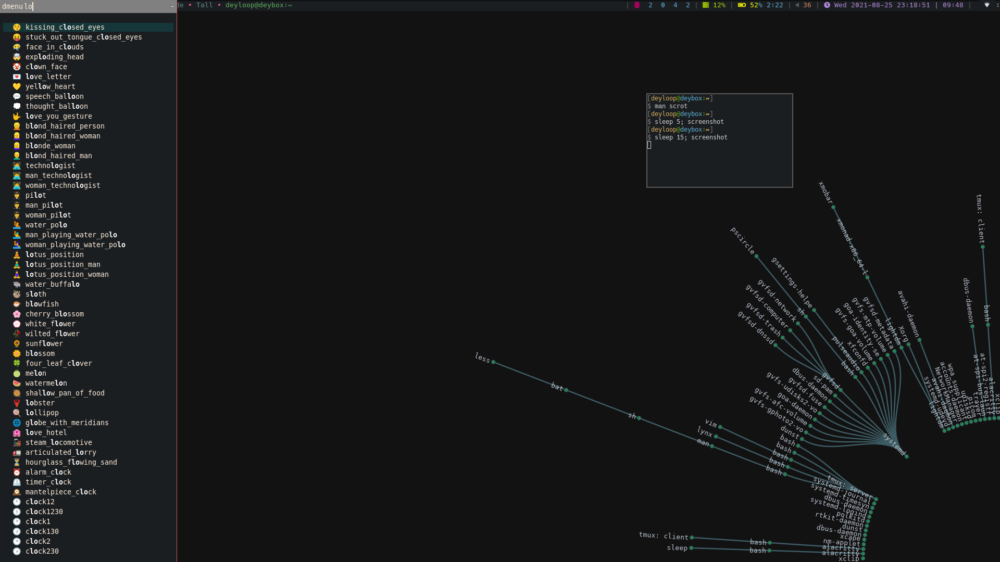
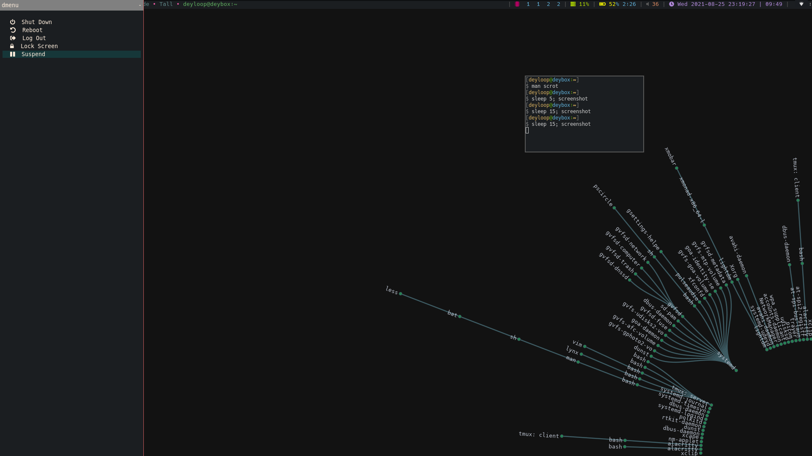

# Dot files for **deyloop**

Collection of scripts and config files. Should be able to replicate `deyloop`s
personal setup on any arch-based distribution of linux.

## Screenshots

Here are some screenshots of the desktop these config files achieve:

